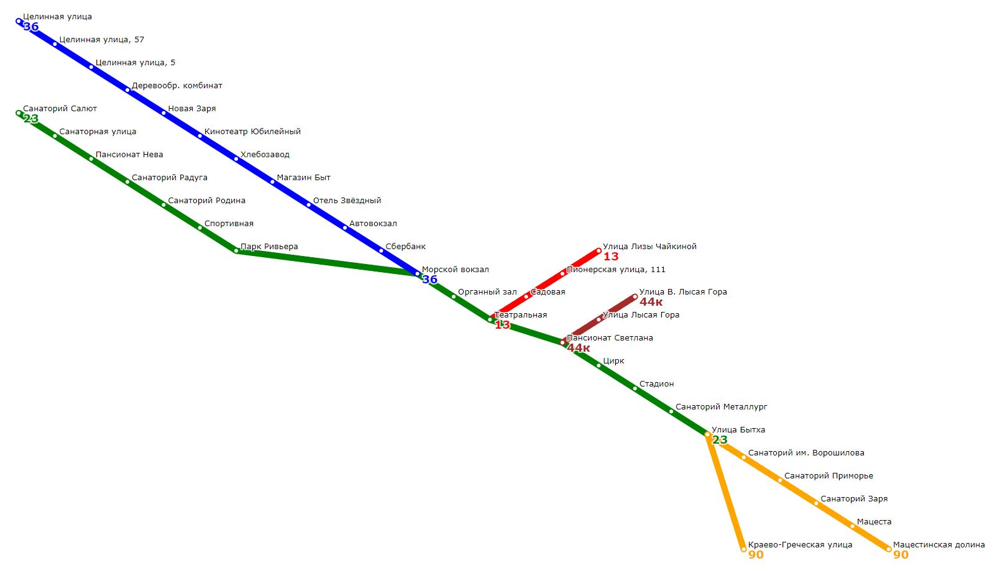
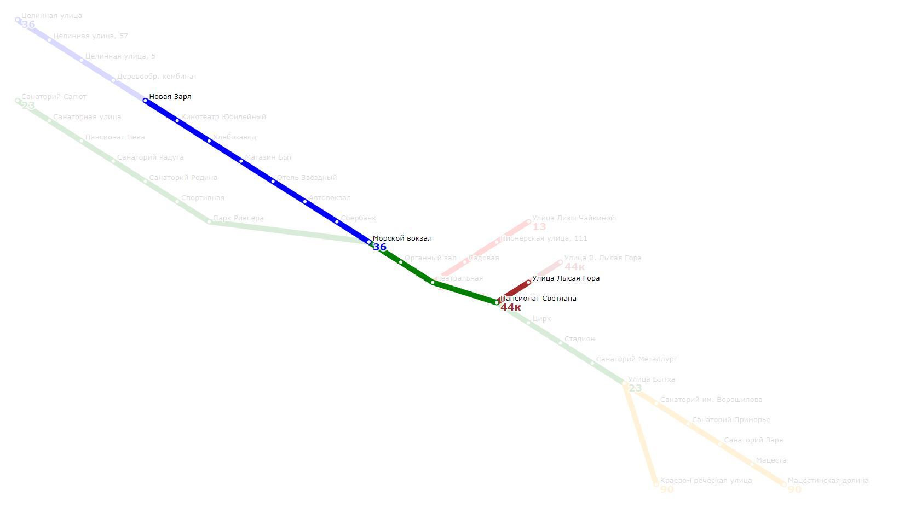

# Транспортный каталог
Программа для построения транспортных маршрутов между остановками общественного транспорта и маршрутов до организаций.  
Маршрут выдается в формате JSON, содержащем карту маршрута в SVG-формате, а так же параметры маршрута - время в пути, требуемые номера автобусов, пересадочные остановки.

# Установка
### Требования
Установленный Google Protobuf.

### Сборка (для Eclipse IDE)
1. Создать на одном уровне с папкой `src` папку `build`
2. Перейти в папку `build` и выполнить команду `cmake.exe -G "Eclipse CDT-4 MinGW Makefiles" -DCMAKE_PREFIX_PATH={path to brotobuf} ..\src`
3. В Eclipse IDE сделать импорт собранного проекта из папки build

# Использование

	transport_catalog_part_r [make_base|process_requests|run_tests]

Опция `make_base` - создание транспортного каталога и его сериализация с использование Google Protobuf.  
Опция `process_requests` - десериализация каталога и обработка информационных запросов.  
Опция `run_test` - запуск встроенных тестов (может занять продолжительное время).  

### Формат входных данных для построения каталога (опция make_base)
Программа считывает данные для построения транспортного каталога из стандартного потока ввода в формате JSON.
Шаблон входного JSON:  

	{  
		"serialization_settings": {...},  
		"routing_settings": {...},  
		"base_requests": [...], 
		"render_settings": {...},  
		"yellow_pages": {...}  
	}  

#### Ключ "serialization_settings"

Ключ задает имя файла, в который будет сериализован транспортный каталог. 
Программа автоматически не создает директорию, в которой будет расположен файл. Для корректной работы программы необходимо создать этот каталог  
перед ее вызовом.

	"serialization_settings": {
		"file": "FILENAME"
	}

#### Ключ "routing_settings"

Ключ задает настройки маршрутизатора, которые будут использованы при построении маршрутов. Содержит три обязательных поля:
1. "bus_wait_time" - время ожидания автобуса на остановке в минутах. Считается, что пассажир ждет автобуса bus_wait_time минут при посадке в автобус и на пересадочных остановках, если такие имеются.
2. "bus_velocity" - скорость автобуса в км/ч.
3. "pedestrian_velocity" - скорость пешехода в км/ч, используется при построении маршрутов до организаций.

Пример:

	"routing_settings": {
        "bus_wait_time": 2,
        "bus_velocity": 30,
        "pedestrian_velocity": 5
    }

#### Ключ "base_requests"

Ключ задает массив запросов для создания справочника. Запросы бывают двух типов: `bus` и `stop`. Запрос типа `bus` задает параметры автобуса, `stop` - параметры остановки. 

##### Запрос "Bus"

Поля запроса:  

1. "type" - определяет тип запроса. Для автобуса должен иметь значение "Bus".  
2. "name" - название (номер маршрута) автобуса. Значение - любая (уникальная в рамках работы программы) строка.  
3. "is_roundtrip" - кольцевой маршрут или нет. Значение - true или false. Для кольцевого маршрута первая и последняя остановки в описании (см. ниже) совпадают, для некольцевого - нет. Для некольцевого маршрута считается, что автобус проходит все остановки в порядке, заданным описанием маршрута, а затем в обратном порядке. По кольцевому маршруту автобус движется лишь в одну сторону. На конечной (она же - начальная) остановке кольцевого маршрута автобус высаживает всех пассажиров, и при необходимости дальнейшего следования по этому маршруту они ожидают bus_wait_time минут на конечной. На конечных остановках некольцевых маршрутов также происходит высадка всех пассажиров.  
4. "stops" - массив названий остановок в порядке следования. Если машрут кольцевой, то первая и последняя остановки в описании должны совпадать.  

Пример:

	{
        "type": "Bus",
        "name": "13",
        "stops": [
            "Улица Лизы Чайкиной",
            "Пионерская улица, 111",
            "Садовая",
            "Театральная"
        ],
        "is_roundtrip": false
    }
Задает некольцевой маршрут с названием "13", следующего по маршруту Улица Лизы Чайкиной -> Пионерская улица, 111 -> Садовая -> Театральная -> Садовая -> Пионерская улица, 111 -> Улица Лизы Чайкиной.

Запрос

	{
        "type": "Bus",
        "name": "14a",
        "stops": [
            "Улица Лизы Чайкиной",
            "По требованию",
            "Улица Докучаева",
            "Улица Лизы Чайкиной"
        ],
        "is_roundtrip": true
    }
Создает кольцевой маршрут Улица Лизы Чайкиной -> По требованию -> Улица Докучаева -> Улица Лизы Чайкиной с названием "14a".

##### Запрос "Stop"

1. "type" - определяет тип запроса. Для остановки должен иметь значение "Stop".  
2. "name" - название остановки. Значение - любая (уникальная в рамках работы программы) строка.  
3. "latitude" - географическая широта остановки в десятичной записи.  
4. "longitude" - географическая долгота остановки в десятичной записи.  
4. "road_distances" - словарь, указывающий физические расстояния до соседних остановок в метрах. Данные расстояния могут быть больше расстояния, вычисленного из географических координат. Указываются расстояния лишь для тех остановок, которые соединены какими-либо автобусными маршрутами. Для двух соседних остановок достаточно указать road_distances только в описании одной остановки, однако, для всех остановок, участвующих в построении маршрутов так или иначе должны быть указаны физические расстояния до соседних.  

Пример:

    {
        "type": "Stop",
        "name": "Улица Лизы Чайкиной",
        "latitude": 43.590317,
        "longitude": 39.746833,
        "road_distances": {
            "Пионерская улица, 111": 950
        }
    },
    {
        "type": "Stop",
        "name": "Пионерская улица, 111",
        "latitude": 43.587257,
        "longitude": 39.740325,
        "road_distances": {
            "Садовая": 520
        }
    },
    {
        "type": "Stop",
        "name": "Садовая",
        "latitude": 43.58395,
        "longitude": 39.736938,
        "road_distances": {}
    }

Эти запросы задают корректно задают физичесике расстояния между 3 остановками - "Улица Лизы Чайкиной", "Пионерская улица, 111", "Садовая".

#### Ключ "render_settings"

Описывает словарь настроек отображения карты и маршрутов в svg-документе. Имеет следующие записи:  
1. "width": int - ширина изображения в пикселях  
2. "height": int - высота изображения в пикселях  
3. "padding": int - отступ от краев в пикселях  
4. "outer_margin": int - выступ подложки в пикселях  
5. "stop_radius": int - радиус маркера остановки  
6. "line_width": int - ширина линии, обозначающей автобусную линию  
7. "bus_label_font_size": int - размер шрифта для номеров автобусов  
8. "bus_label_offset": [int, int] - отступ для названия автобусоа  
9. "stop_label_font_size": int - размер шрифта для названий остановок  
10. "stop_label_offset": [int, int] - отступ для названий остановок  
11. "underlayer_color": [int, int, int, double] - цвет полупрозрачной подложки  
12. "underlayer_width": int - толщина контура обводки названий  
13. "color_palette": [RGBColor1, ...] - цветовая палитра автобусных линий. Если количество автобусов превышает размер палитры, то цвета линий выбираются циклически  
14. "company_label_font_size": int - размер шрифта для названий компаний  
15. "company_label_offset": [int, int] - отступ для названий компаний  
16. "company_line_width": int - толщина линии для отрезка пути от остановки до компании  
17. "company_stop_color": [int, int, int] - цвет маркера для компании  
18. "company_line_color": [int, int, int] - цвет линии для отрезка пути от остановки до компании  
19. "layers": ["layer1", ..] - порядок отображения слоев. Допустимые имена слоев: "bus_lines", "bus_labels", "stop_points", "stop_labels", "company_line", "company_point", "company_label"

#### Ключ "yellow_pages"

Описывает справочник организаций. Содержит 2 записи - rubrics и companies. Первая задает отображение названий рубрик на целые числа, вторая - собственно сам справочник организаций.  
Пример rubrics, задающей соответсвие для двух рубрик:  

	"rubrics": {
            "1": {
                "name": "Парк"
         		},
         	"2": {
         		"name": "Кинотеатр"
         		}
    }

"companies": [company1, ...] - массив компаний. Каждая компания описывается словарем, могущим содержать следующие записи:  
1. "names": [name1, name2, ...] - массив названий компании. Каждое название - словарь вида {"value": "string", ["type": "MAIN"|"SHORT"|"SYNONYM"]}. У каждой компании должно быть как минимум одно MAIN-название. По умолчанию тип названия - MAIN.  
2. "urls": [url1, ...] - массив url-адресов компании. Каждый url - словарь с единственной записью вида {"value": "string"}. Компания может не иметь url-адресов.  
3. "rubrics": [int1, int2, ...] - массив рубрик, к которым относится компания в соответсвии с отображением rubrics (см. выше). Необязательная запись.  
4. "address": {"coords": {"lat": double, "lon": double}} - координаты компании. Обязательная запись.  
5. "nearby_stops": [{"name": "string", "meters": int}, ...] - расстояния до ближайших остановок (в метрах). Для построения маршрута до организации должно быть указано хотя бы одно расстояние до какой-либо остановки.  
6. "phones": [phone1, ...] - массив телефонных номеров компании. Каждый элемент - словарь вида {"type": ["PHONE"|"FAX"], "country_code": "string", "local_code": "string", "number": "string", "extension": "string"}. Все записи необязательны. У компании может не быть телефонных номеров.

[Пример](./test_inputs/part_t_make_base.txt) входного файла для конфигурации каталога.

### Формат запросов к транспортному каталогу (опция process_requests)

Программа считывает запрос в формате JSON из стандартного потока ввода. Формат запрос имеет следующий вид:  

	{
	    "serialization_settings": {
	        "file": "path_to_serialized_catalog"
	    },
	    "stat_requests": [
	        RequestDict1,
	        RequestDict2,
	        ...
	    ]
	}

где `RequestDict1, ...` - запросы, заданные в виде словарей (см. ниже).  
Результат обработки запросов выводится в формате JSON в стандартный поток вывода:  

	[
		ResponseDict1,
		ResponseDict2,
		....
	]

Транспортный каталог поддерживает следующие виды запросов:  
1. "Stop" - выводит информацию об автобусах, проходящих через данную остановку  
2. "Bus" - выводит информацию об автобусном маршруте  
3. "Map" - выводит схему автобусных маршрутов  
4. "Route" - строит маршрут между остановками и рисует его на схеме  
5. "RouteToCompany" - выполняет поиск подходящих по фильтрам компаний и строит маршрут до ближайшей  

Каждому запросу необходимо присвоить уникальный id - неотрицательное число.

#### Запрос "Stop"

Формат запроса:

	{
		"id": number,
		"type": "Stop",
		"name": "stop_name"
	}

Находит названия автобусов, проходящих через остановку с названием "stop_name".  
Формат ответа:  

	{
		"id": number,
		"buses": ["bus1", ...]
	}

Если остановки с заданным именем не существует, выводится сообщение об ошибке:

	{
		"id": number,
		"error_message": "not found"
	}

#### Запрос "Bus"

Формат запроса:

	{
		"id": number,
		"type": "Bus",
		"name": "bus_name"
	}

Выводит информацию об автобусном маршруте "bus_name".  
Формат ответа:  

	{
		"request_id": number,
		"route_length": int,
		"stop_count": int,
		"unique_stop_count": int,
		"curvature": double
	}

где `route_length` - общая физическая протяженность маршрута в метрах, `stop_count` - общее количество остановок на маршруте, `unique_stop_count` - количество уникальных остановок на маршруте, `curvature` - кривизна маршрута - отношение физической флины маршрута к длине, вычисленной по географическим координатам в предположении, что остановки соединены прямыми отрезками.  
Если автобуса с заданным именем не существует, выводится сообщение об ошибке:

	{
		"id": number,
		"error_message": "not found"
	}

#### Запрос "Map"

Выводит схему автобусных маршрутов в svg - формате (символы "\" и """ экранированы в выходной строке, поскольку вывод осуществляется в формате JSON).

Формат запроса:

	{
		"id": number,
		"type": "Map"
	}

Формат ответа:

	{
		"id": number,
		"map": "svg document"
	}

[Пример](./test_out/map_response1.txt) ответа на запрос "Map".  

Вид схемы:

#### Запрос "Route"

Строит маршрут между двумя остановками. Также строит маршрут на схеме автобусов.

Формат запроса:

    {
        "id": number,
        "type": "Route",
        "from": "stop_from",
        "to": "stop_to"
    }

Формат ответа:

	{
		"id": number,
		"items": [RouteItem1, ....],
		"total_time": double,
		"map": "svg document"
	}

где `items` - элементы маршрута. Бывают двух типов:  
1. Ожидание автобуса на начальной или пересадочной остановке. Имеет формат `{"stop_name": "string", "time": int, "type": "Wait"}`, где `stop_name` - название остановки, `time` - время ожидания в минутах (равно параметру `bus_wait_time` в `routing_settings`), `type` - тип элемента - ожидание.  
2. Поездка на автобусе. Имеет формат `{"bus": "string", "span_count": int, "time": double, "type": "Bus"}` , где `bus` - название автобуса, `span_count` - количество остановок, которые нужно на нем проехать, считая от предыдущего элемента типа `wait`, `time` - время следования в минутах.  
Элементы маршрута расположены в порядке следования по маршруту.  

`total_time` - общее время следования по маршруту с учетом ожидания на остановках.  

`map` - svg-документ - схема автобусов с построенным маршрутом. Пример маршрута:

#### Запрос "RouteToCompany"

Строит маршрут до ближайшей организации, удовлетворяющей определенным критериям.

Формат запроса:

	{
		"id": number,
		"from": "stop_name",
		"filter": {FilterDict1, ...}
	}

Формат ответа:

	{
		"id": number,
		"total_time": double,
		"items": [RouteItem1, ...],
		"map": "svg document"
	}

### Запуск внутренних тестов (опция run_tests)